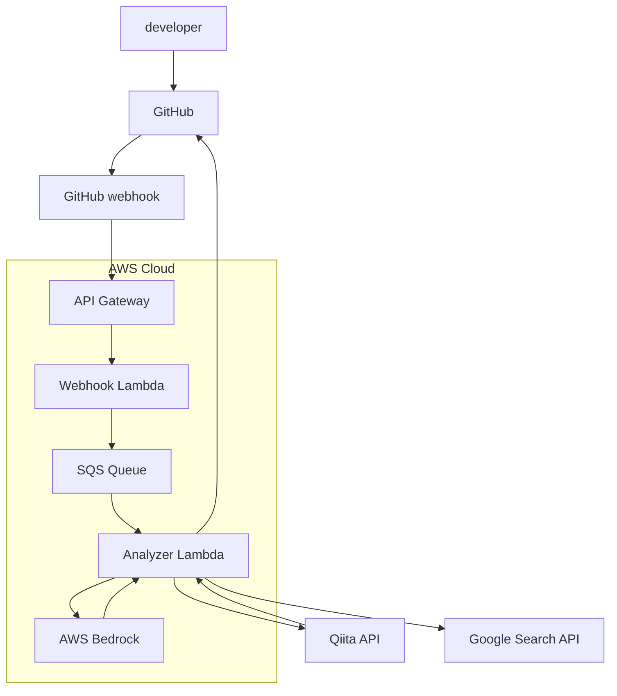

# 🐹 code-mole

> An intelligent code review assistant that digs deep into your code to find issues and suggests helpful learning resources.

code-mole is an AI-powered code review assistant that automatically analyzes your GitHub pull requests, identifies potential issues, and provides curated learning resources to help you improve your coding skills.

## ✨ Features

### 🔍 Smart Code Analysis
- **Deep Code Review**: Analyzes your code for bugs, security issues, and performance problems
- **Frontend Focused**: Specialized analysis for React, Vue.js, and modern JavaScript frameworks
- **Best Practices**: Suggests improvements based on industry standards and coding conventions

### 📚 Learning Resources Integration
- **Curated Articles**: Automatically finds relevant technical articles from Qiita, and official documentation
- **Japanese Content Priority**: Prioritizes Japanese language resources for better accessibility

### 🤖 AI-Powered Intelligence
- **AWS Bedrock Integration**: Leverages Claude and other advanced language models
- **Continuous Learning**: Improves suggestions based on your codebase and preferences
- **Multi-Language Support**: Supports various programming languages with focus on web technologies

## 🏗️ Architecture

## 🛠️ Technology Stack

- **Backend**: AWS Lambda(Typescript), API Gateway, SQS
- **AI/ML**: AWS Bedrock (Claude, LLaMA)
- **Integration**: GitHub API, Webhooks

## 📖 Documentation

- [Getting Started Guide](docs/getting-started.md)
- [API Reference](docs/api-reference.md)
- [Configuration Options](docs/configuration.md)
- [Contributing Guidelines](CONTRIBUTING.md)

## 🎯 Roadmap

### Current (MVP)
- [ ] Basic code review functionality
- [ ] Learning resource suggestions
- [ ] GitHub integration
- [ ] Web dashboard

### Upcoming Features
- [ ] SEO analysis for web applications
- [ ] Performance optimization suggestions
- [ ] IDE extensions (VS Code, WebStorm)
- [ ] Slack/Discord notifications
- [ ] Team collaboration features

## 🤝 Contributing

We welcome contributions! code-mole is designed to help developers learn and grow together.

1. Fork the repository
2. Create your feature branch (`git checkout -b feature/amazing-feature`)
3. Commit your changes (`git commit -m 'Add some amazing feature'`)
4. Push to the branch (`git push origin feature/amazing-feature`)
5. Open a Pull Request

See [CONTRIBUTING.md](CONTRIBUTING.md) for detailed guidelines.

## 📄 License

This project is licensed under the MIT License - see the [LICENSE](LICENSE) file for details.

## 📧 Contact

- GitHub Issues: [Report bugs or request features](https://github.com/HasutoSasaki/code-mole/issues)

---

Made with ❤️ by developers, for developers. Happy coding! 🐹✨